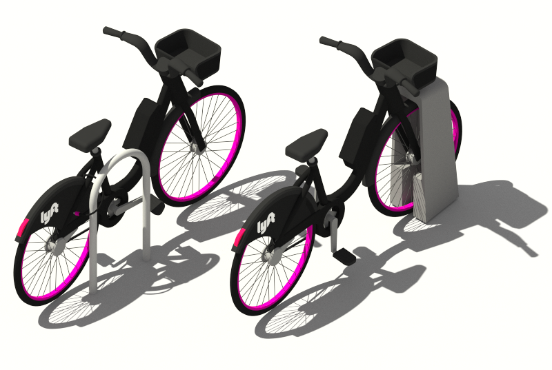

# Communicate-Data-Findings for the dataset Baywheels former Ford GoBike
Udacity's Data Analyst Nanodegree - Project 5

## Introduction
Ford GoBike is the Bay Area's bike share system. Bay Area Bike Share was introduced in 2013 as a pilot program for the region, with 700 bikes and 70 stations across San Francisco and San Jose. Once expansion is complete, Ford GoBike will grow to 7,000 bikes across San Francisco, the East Bay and San Jose.

Ford GoBike, like other bike share systems, consists of a fleet of specially designed, sturdy and durable bikes that are locked into a network of docking stations throughout the city. The bikes can be unlocked from one station and returned to any other station in the system, making them ideal for one-way trips. People use bike share to commute to work or school, run errands, get to appointments or social engagements and more. It's a fun, convenient and affordable way to get around.

The bikes are available for use 24 hours/day, 7 days/week, 365 days/year and riders have access to all bikes in the network when they become a member or purchase a pass.

I have special interest in start and end of rides. Users characteristics between Customer and Subscriber, day of weeks with high usage. The main goal is to identify the customer comsumption patterns of bike riding.

## Project Details

1. Dataset: [Baywheels Bike](https://s3.amazonaws.com/baywheels-data/index.html)
2. Explore the data: Conduct EDA to define cleaning and tranformation steps 
3. Document the story: organized findings convey a story to present to an audience.
4. Communicate the findings - a slide deck was prepared to present key findings to a broader audience

## Project Findings

The data includes information about individual rides made in a bike-sharing system covering the greater San Francisco Bay area. The data is from 2019. The total amount of data is 2.506.983 rides.

### Types of users

In this dataset there are 2 types of users (`Subscriber` and `Customer`). In most of the cases (80,4%) the user is `Subscriber` and the rest (19,6%) the user is `Customer`.

### Types of user per month

The amount of customers and subscribers increase during the summer and then it decrease on the winter. In the case of the subscribers, we can see an increment in `December` but actually it looks like it should be a decrease, so this is also interesting to take into account.

### Start and ends of the rides for each type of user

There is a high demand at 8-9 am and then at 5 - 6 pm. Basically when the people start and end of the work. If we look on the subscribers and customers, we can see that there are more customers using it at the afternoon compared on the moorning.

### Customer Usage by Weekday vs. Subscriber Usage by Weekday

The point plot above is an excellent visual showing the sharp contrast between Customers and Subscribers. Customers have a relatively low usage of the bike share system with a small increase on Fridays. Subscribers are the opposite - there is steadily high usage on weekdays, with a sharp decline on the weekend.

### Customer Usage by Duration vs. Subscriber Usage by Duration
The plots above show the ride duration spread in minutes (note the y-axis isn't shared between the Customer and Subscriber graphs for visualization purposes). Customer typically have trip durations are longer (8 to 18 minutes according to the box plot) than for subscribers (5 to 12 minutes according to the box plot). This can probably be explained by the fact that subscribers are mainly commuters who take short trips to work/school rather than longer trips around the Bay Area.

### List of the top 10 start stations
In the top ten stations the `Subscribers` users are higher when are compared with `Customers` user type.

### Final Thoughts
Renting a bike from the Baywheels Bike System is a fantastic way of moving around in the city, both for enjoyment and work. There are two types of clients using the system: Subscribers and Customers. 

- Subscribers are primarily daily commuters, having short trips to and from work, who rent a bike on weekdays at 8-9am and 5-6pm, and, occasionally around lunch time. 
- Customers are usually tourists or occassional riders who use the system mainly on weekends to explore the Bay Area.

## References

* [StackOverflow 1](https://stackoverflow.com/questions/26942476/reading-csv-zipped-files-in-python) reading zip files
* [StackOverflow 2](https://stackoverflow.com/questions/24870306/how-to-check-if-a-column-exists-in-pandas) check the column existance
* [Github 1](https://github.com/shravankoninti/Udacity_DataAnalyst/blob/master/Project_5_Visualization/Exploratory_visualization.ipynb)  Github Reference 1
* [Github 2](https://github.com/chelseymarie6/Communicate-Data-Findings/blob/master/CommunicateData.ipynb) Github Reference 2
* [Github 3](https://github.com/kzhang789/Communicate-data-findings/blob/master/fordgobike_exploration.ipynb) Github Reference 3
* [Github 4](https://github.com/somya1212/Communicate-Ford-Bike-Data-Findings/blob/master/exploration_template_notebook.ipynb) Github Reference 4

Note: The Github references were used to develop this project, some lines of codes and thought process were used to succesfully complete this deliverable.

## Files
- readme.md - Document, in plain text, Markdown, or PDF format, including the following information: dataset, main findings and references

- exploration_template.ipynb - This Jupyter Notebook contains section templates to help you organize your exploration, starting from loading in the data, working through univariate visualizations, and ending with bivariate and multivariate exploration. 

- slide_deck_template.ipynb - This Jupyter Notebook contains starter cells to help you organize your slide deck deliverable. These cells provide an example of how the slide deck should be organized, including pre-set slideshow settings.

To view the slide deck, you will need to use the expression (all one line):
jupyter nbconvert slide_deck.ipynb --to slides --post serve --template output_toggle

- output_toggle.tpl - This template file can be used with nbconvert to export your slide deck. This adds extra functionality to the slide deck by hiding the code to start, only making it visible if the reader clicks on the output (which should mostly be visualizations in the case of this project). 

baywheels.png - Image of baywheels bikes, used in this readme.md document.
